# DOCUMENTO DE ARQUITECTURA DE SOFTWARE (SAD)

## SMS-EDUCOL — Sistema de Gestión Académica para Instituciones Educativas Colombianas

---

**Versión:** 1.0  
**Fecha:** 07 de Mayo de 2026  
**Estado:** Aprobado para Desarrollo  
**Arquitecto Responsable:** Equipo de Ingeniería de Software  
**Stack Tecnológico:** Laravel 13.x, PHP 8.3+, PostgreSQL 16+, Redis 7.x  
**Patrón Arquitectónico:** Hexagonal (Ports & Adapters) + DDD Táctico  
**Estructura:** Modular por Dominio  

---

## CONTROL DE VERSIONES

| Versión | Fecha | Autor | Cambios |
|---------|-------|-------|---------|
| 1.0 | 2026-05-07 | Arquitecto Software | Versión inicial con modelo C4, diagramas hexagonales y especificación de módulos. Unificación de versiones y terminología. |

---

## TABLA DE CONTENIDOS

1. [Introducción](#1-introducción)
2. [Objetivos y Alcance](#2-objetivos-y-alcance)
3. [Stakeholders y Audiencia](#3-stakeholders-y-audiencia)
4. [Vista de Contexto — Modelo C4 Nivel 1](#4-vista-de-contexto--modelo-c4-nivel-1)
5. [Vista de Contenedores — Modelo C4 Nivel 2](#5-vista-de-contenedores--modelo-c4-nivel-2)
6. [Vista de Componentes — Modelo C4 Nivel 3](#6-vista-de-componentes--modelo-c4-nivel-3)
7. [Vista de Código — Modelo C4 Nivel 4](#7-vista-de-código--modelo-c4-nivel-4)
8. [Arquitectura Hexagonal Detallada](#8-arquitectura-hexagonal-detallada)
9. [Estructura de Módulos](#9-estructura-de-módulos)
10. [Flujo de Datos entre Capas](#10-flujo-de-datos-entre-capas)
11. [Decisiones Arquitectónicas (ADRs)](#11-decisiones-arquitectónicas-adrs)
12. [Estrategia de Persistencia](#12-estrategia-de-persistencia)
13. [Estrategia de Eventos de Dominio](#13-estrategia-de-eventos-de-dominio)
14. [Estrategia de Testing](#14-estrategia-de-testing)
15. [Reglas de Codificación Arquitectónica](#15-reglas-de-codificación-arquitectónica)
16. [Riesgos Arquitectónicos](#16-riesgos-arquitectónicos)
17. [Anexos](#17-anexos)

---

## 1. INTRODUCCIÓN

### 1.1 Propósito

Este documento establece la arquitectura de software para SMS-EDUCOL, definiendo:

- La estructura modular del sistema y las responsabilidades de cada módulo
- El patrón arquitectónico hexagonal aplicado al contexto de Laravel 13.x
- Las decisiones técnicas fundamentales y sus justificaciones
- Los flujos de datos críticos entre capas y módulos
- Las reglas de codificación que garantizan la integridad arquitectónica

### 1.2 Relación con el SRS

| Documento | Propósito | Estado |
|-----------|-----------|--------|
| SRS (Software Requirements Specification) | Define QUÉ construir: requisitos funcionales y no funcionales | Completado |
| **SAD (este documento)** | Define CÓMO construirlo: estructura, patrones, flujos | En elaboración |
| Esquema de Base de Datos | Define DÓNDE persistir: modelo relacional PostgreSQL | Completado |

**Trazabilidad SRS → SAD:**

| Requisito SRS | Módulo SAD | Componente Arquitectónico |
|--------------|------------|--------------------------|
| RF-01 (Autenticación) | `SMS\Users` | `AuthenticateUserUseCase`, `LaravelAuthAdapter` |
| RF-02 (Gestión Usuarios) | `SMS\Users`, `SMS\Students`, `SMS\Teachers` | Entidades, Repositorios, Controladores |
| RF-03 (Config. Académica) | `SMS\Academic` | `AcademicYear`, `Grade`, `Group` entidades |
| RF-04 (Matrículas) | `SMS\Enrollments` | `EnrollmentService`, `EnrollmentRepository` |
| RF-05 (Asistencia) | `SMS\Attendance` | `AttendanceRecord`, `AttendanceRepository` |
| RF-06 (Calificaciones) | `SMS\Grades` | `GradeRecord`, `GradeCalculationService` |
| RF-07 (Reportes) | `SMS\Reports` | `ReportGenerator`, `PDFAdapter`, `ExcelAdapter` |
| RF-08.1 (Info Institución) | `SMS\Shared` | `SchoolInfoRepository`, `SchoolInfoController` |
| RF-08.2 (Gestión Administradores) | `SMS\Users` | `CreateAdminUseCase`, `AdminRolePolicy` |
| RNF-02 (Seguridad) | `SMS\Users` | `Password` Value Object, `Role` enum |
| RNF-06 (Rendimiento) | Infraestructura | Redis Cache, PostgreSQL índices |

---

## 2. OBJETIVOS Y ALCANCE

### 2.1 Objetivos de la Arquitectura

1. **Independencia del framework:** El dominio de negocio no depende de Laravel, Eloquent ni PostgreSQL
2. **Testabilidad:** Tests unitarios del dominio ejecutables en milisegundos sin base de datos
3. **Modularidad:** Cada módulo (Users, Students, Grades) puede desarrollarse, testearse y desplegarse de forma aislada
4. **Escalabilidad evolutiva:** Posibilidad de extraer módulos a microservicios sin reescribir el dominio
5. **Cumplimiento normativo:** Soporte para regulaciones educativas colombianas (Decreto 1290/2009, Resolución 1296/2010)

### 2.2 Alcance

**Incluido:**
- Arquitectura hexagonal aplicada a 8 módulos de dominio
- Modelo C4 completo (4 niveles)
- Estrategia de persistencia con PostgreSQL y Eloquent como adaptador
- Comunicación entre módulos vía eventos de dominio
- Estrategia de testing por capas

**Excluido:**
- Arquitectura de despliegue e infraestructura física (servidores, redes)
- Diseño detallado de interfaces de usuario (wireframes, mockups)
- Estrategia de CI/CD completa (pipelines, ambientes)

---

## 3. STAKEHOLDERS Y AUDIENCIA

| Rol | Interés en el SAD | Nivel de Detalle Requerido |
|-----|-------------------|---------------------------|
| **Desarrollador Backend** | Entender dónde colocar código nuevo, cómo testear | Nivel 3-4 (componentes y código) |
| **Líder Técnico / Arquitecto** | Validar decisiones, planificar evolución | Nivel 1-2 (contexto y contenedores) |
| **DevOps** | Comprender dependencias entre servicios | Nivel 2 (contenedores) |
| **QA Engineer** | Diseñar estrategia de testing por capas | Nivel 3 (componentes) |
| **Directivo Institución Educativa** | Entender capacidades y limitaciones técnicas | Nivel 1 (contexto) |

---

## 4. VISTA DE CONTEXTO — MODELO C4 NIVEL 1

El diagrama de contexto muestra SMS-EDUCOL como una caja negra y sus interacciones con actores y sistemas externos.

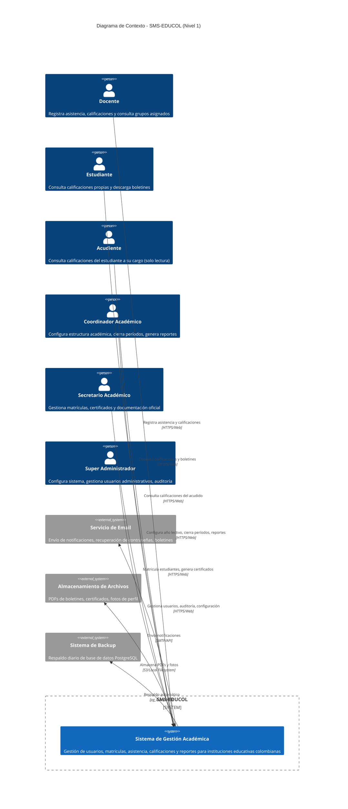

**Descripción:** SMS-EDUCOL es el sistema central que orquesta todas las operaciones académicas. Los usuarios interactúan vía navegador web. El sistema depende de servicios externos para comunicaciones (email), almacenamiento de documentos y respaldo de datos.

---

## 5. VISTA DE CONTENEDORES — MODELO C4 NIVEL 2

El diagrama de contenedores descompone SMS-EDUCOL en sus aplicaciones/servicios principales y tecnologías.

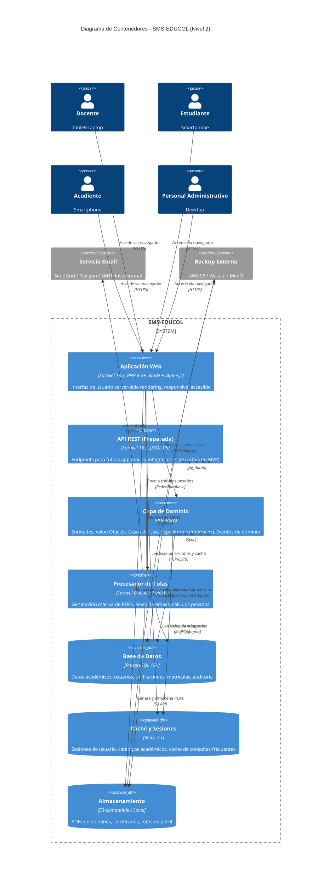

**Descripción:** La aplicación web (monolítica) es el punto de entrada principal. La capa de dominio (PHP puro) es independiente del framework. Los procesos pesados (PDFs, emails) se delegan a colas asíncronas. PostgreSQL es la fuente de verdad; Redis acelera sesiones y consultas.

---

## 6. VISTA DE COMPONENTES — MODELO C4 NIVEL 3

Descompone la aplicación web en sus componentes internos siguiendo la arquitectura hexagonal modular.

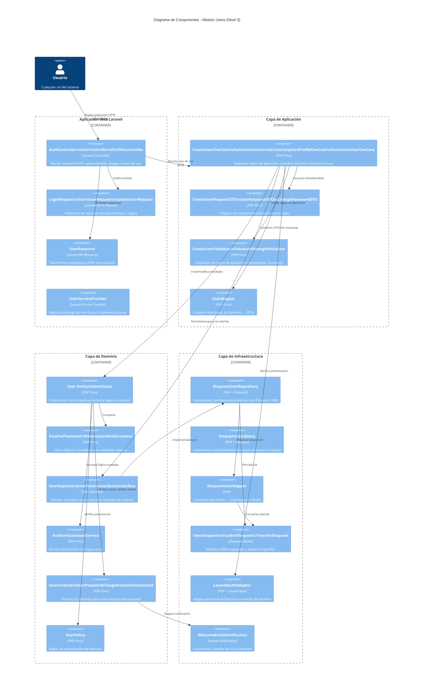

---

## 7. VISTA DE CÓDIGO — MODELO C4 NIVEL 4

Muestra la estructura de directorios y archivos representativos del código fuente.

```mermaid
graph TD
    subgraph "src/SMS/ (Código Fuente)"
        subgraph "Shared/"
            SD[Domain/]
            SI[Infrastructure/]
        end
        
        subgraph "Users/"
            UD[Domain/]
            UA[Application/]
            UI[Infrastructure/]
        end
        
        subgraph "Students/"
            StD[Domain/]
            StA[Application/]
            StI[Infrastructure/]
        end
        
        subgraph "Teachers/"
            TD[Domain/]
            TA[Application/]
            TI[Infrastructure/]
        end
        
        subgraph "Academic/"
            AcD[Domain/]
            AcA[Application/]
            AcI[Infrastructure/]
        end
        
        subgraph "Enrollments/"
            ED[Domain/]
            EA[Application/]
            EI[Infrastructure/]
        end
        
        subgraph "Attendance/"
            AtD[Domain/]
            AtA[Application/]
            AtI[Infrastructure/]
        end
        
        subgraph "Grades/"
            GD[Domain/]
            GA[Application/]
            GI[Infrastructure/]
        end
        
        subgraph "Reports/"
            RD[Domain/]
            RA[Application/]
            RI[Infrastructure/]
        end
    end
    
    subgraph "Detalle Users/Domain/"
        UDE[Entities/]
        UDV[ValueObjects/]
        UDR[Repositories/]
        UDS[Services/]
        UDEv[Events/]
        UDEx[Exceptions/]
    end
    
    subgraph "Detalle Users/Application/"
        UAD[DTOs/]
        UAU[UseCases/]
        UAV[Validators/]
        UAM[Mappers/]
    end
    
    subgraph "Detalle Users/Infrastructure/"
        UIP[Persistence/Eloquent/]
        UIW[Web/Controllers/]
        UIA[Auth/]
        UIN[Notifications/]
    end
    
    UD --> UDE
    UD --> UDV
    UD --> UDR
    UD --> UDS
    UD --> UDEv
    UD --> UDEx
    
    UA --> UAD
    UA --> UAU
    UA --> UAV
    UA --> UAM
    
    UI --> UIP
    UI --> UIW
    UI --> UIA
    UI --> UIN
    
    style SD fill:#e1f5fe
    style UD fill:#fff3e0
    style UA fill:#e8f5e9
    style UI fill:#fce4ec
```

**Estructura de archivos representativa:**

```
src/SMS/
├── Shared/
│   ├── Domain/
│   │   ├── ValueObjects/
│   │   │   ├── Uuid.php
│   │   │   └── Timestamp.php
│   │   ├── Events/
│   │   │   └── DomainEvent.php
│   │   └── Exceptions/
│   │       └── DomainException.php
│   └── Infrastructure/
│       └── Persistence/
│           └── BaseEloquentModel.php
│
├── Users/
│   ├── Domain/
│   │   ├── Entities/
│   │   │   ├── User.php
│   │   │   └── UserStatus.php
│   │   ├── ValueObjects/
│   │   │   ├── Email.php
│   │   │   ├── Password.php
│   │   │   ├── Role.php
│   │   │   ├── UserId.php
│   │   │   └── Document.php
│   │   ├── Repositories/
│   │   │   ├── UserRepositoryInterface.php
│   │   │   └── UserQueryInterface.php
│   │   ├── Services/
│   │   │   └── AuthenticateUserService.php
│   │   ├── Events/
│   │   │   ├── UserCreated.php
│   │   │   ├── UserPasswordChanged.php
│   │   │   └── UserDeactivated.php
│   │   ├── Policies/
│   │   │   └── UserPolicy.php
│   │   └── Exceptions/
│   │       ├── UserNotFoundException.php
│   │       ├── InvalidCredentialsException.php
│   │       └── DuplicateEmailException.php
│   │
│   ├── Application/
│   │   ├── DTOs/
│   │   │   ├── CreateUserRequest.php
│   │   │   ├── UpdateUserRequest.php
│   │   │   ├── ChangePasswordRequest.php
│   │   │   └── UserResponse.php
│   │   ├── UseCases/
│   │   │   ├── CreateUserUseCase.php
│   │   │   ├── AuthenticateUserUseCase.php
│   │   │   ├── UpdateProfileUseCase.php
│   │   │   └── DeactivateUserUseCase.php
│   │   ├── Validators/
│   │   │   ├── CreateUserValidator.php
│   │   │   └── PasswordStrengthValidator.php
│   │   └── Mappers/
│   │       └── UserMapper.php
│   │
│   └── Infrastructure/
│       ├── Persistence/
│       │   └── Eloquent/
│       │       ├── Models/
│       │       │   ├── UserEloquent.php
│       │       │   └── PasswordResetTokenEloquent.php
│       │       ├── Repositories/
│       │       │   ├── EloquentUserRepository.php
│       │       │   └── EloquentUserQuery.php
│       │       └── Mappers/
│       │           └── EloquentUserMapper.php
│       ├── Web/
│       │   ├── Controllers/
│       │   │   ├── AuthController.php
│       │   │   ├── UserController.php
│       │   │   └── ProfileController.php
│       │   ├── Requests/
│       │   │   ├── LoginRequest.php
│       │   │   ├── StoreUserRequest.php
│       │   │   └── UpdateUserRequest.php
│       │   └── Resources/
│       │       └── UserResource.php
│       ├── Auth/
│       │   └── LaravelAuthAdapter.php
│       └── Notifications/
│           └── WelcomeEmailNotification.php
│
└── [Otros módulos: Students, Teachers, Academic, Enrollments, Attendance, Grades, Reports]
    └── [Estructura análoga: Domain/, Application/, Infrastructure/]
```

---

## 8. ARQUITECTURA HEXAGONAL DETALLADA

### 8.1 Principios Fundamentales

La arquitectura hexagonal (Ports & Adapters) organiza el software en tres capas concéntricas con reglas estrictas de dependencia:

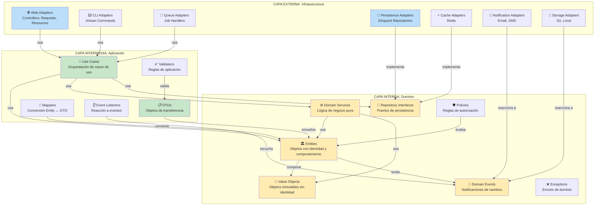

### 8.2 Reglas de Dependencia

| Regla | Descripción | Ejemplo de Violación |
|-------|-------------|---------------------|
| **R1** | El Dominio no conoce frameworks ni librerías externas | `use Illuminate\Support\Collection;` en `src/SMS/Users/Domain/Entities/User.php` |
| **R2** | La Aplicación no conoce detalles de persistencia | `DB::transaction()` en un UseCase |
| **R3** | La Infraestructura no contiene lógica de negocio | Calcular promedio en un Controller |
| **R4** | Las dependencias apuntan siempre hacia el centro | Un Repository interface importa una clase Eloquent |
| **R5** | Los módulos solo exponen interfaces, no implementaciones | `use Src\SMS\Grades\Infrastructure\Eloquent\GradeRecord` en `Users` |

### 8.3 Comparación: Arquitectura Tradicional vs. Hexagonal

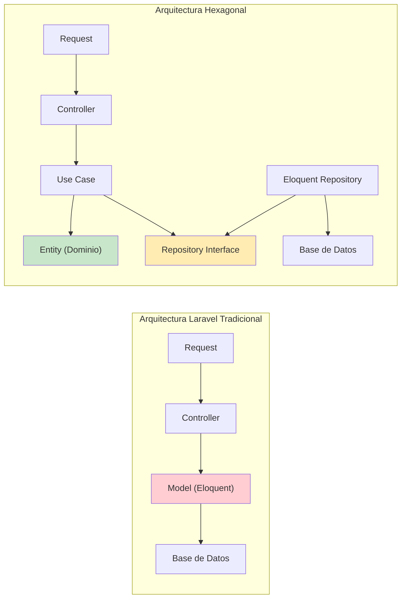

---

## 9. ESTRUCTURA DE MÓDULOS

### 9.1 Módulo: Users (RF-01, RF-02, RF-08.2)

**Responsabilidad:** Autenticación, autorización RBAC, gestión de perfiles de usuario.

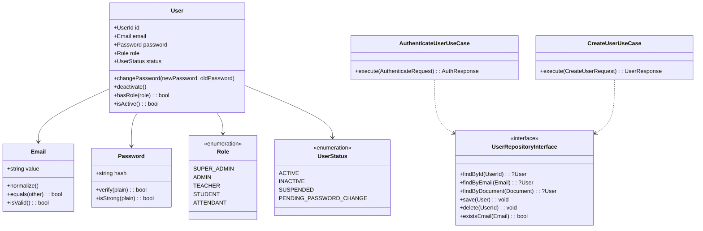

**Puertos exportados (interfaces públicas del módulo):**
- `UserRepositoryInterface` — para búsqueda y persistencia de usuarios
- `AuthenticateUserUseCase` — para verificación de credenciales
- `UserCreated`, `UserPasswordChanged` — eventos de dominio

### 9.2 Módulo: Students (RF-02.1, RF-04)

**Responsabilidad:** Gestión de estudiantes, datos personales, historial académico.

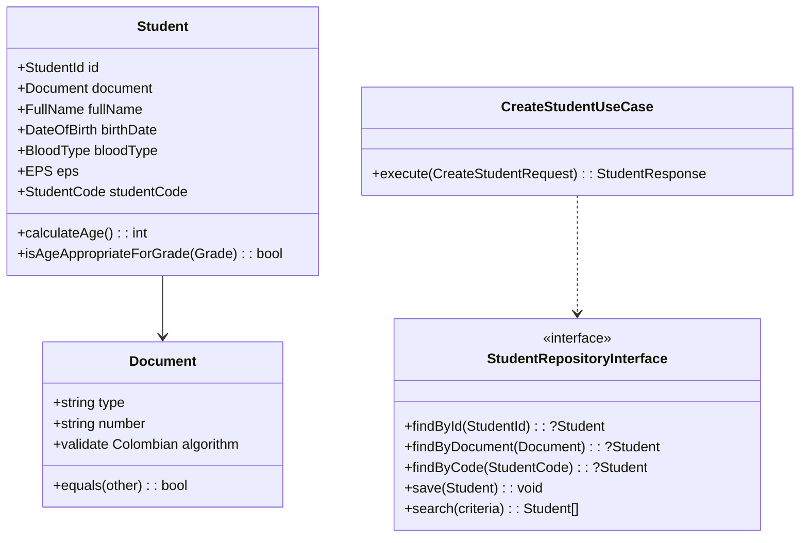

### 9.3 Módulo: Teachers (RF-02.2, RF-03.7)

**Responsabilidad:** Gestión de docentes, especialidades, carga académica.

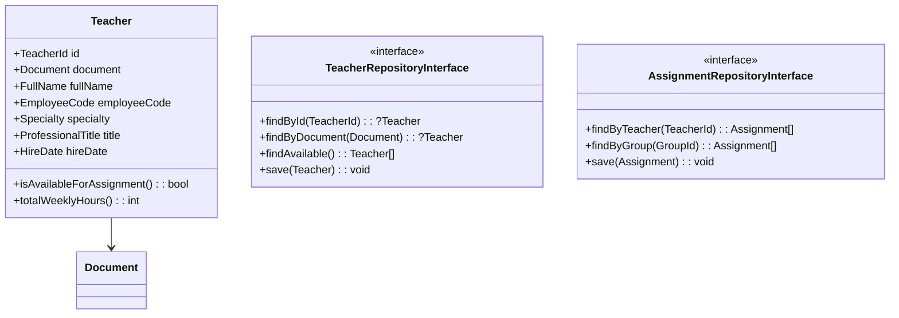

### 9.4 Módulo: Academic (RF-03)

**Responsabilidad:** Configuración de estructura académica: años lectivos, períodos, grados, grupos, asignaturas.

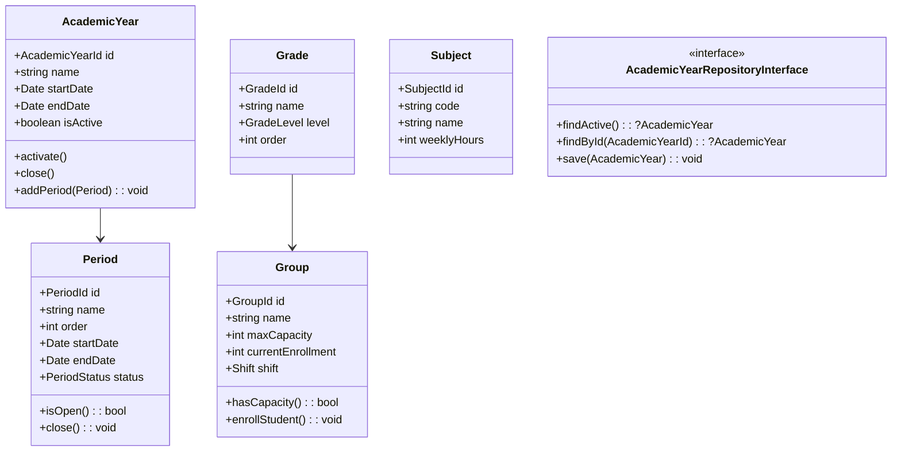

### 9.5 Módulo: Enrollments (RF-04)

**Responsabilidad:** Proceso de matrícula, control de cupos, traslados, retiros.

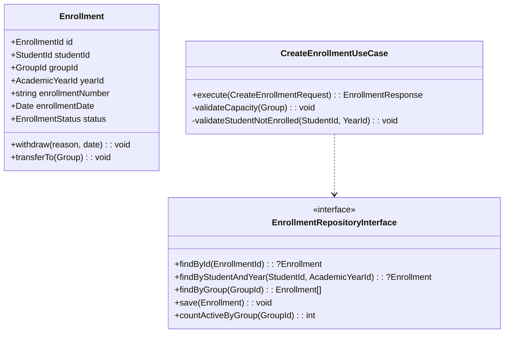

### 9.6 Módulo: Attendance (RF-05)

**Responsabilidad:** Registro diario de asistencia, estados (presente, ausente, tardanza, justificado).

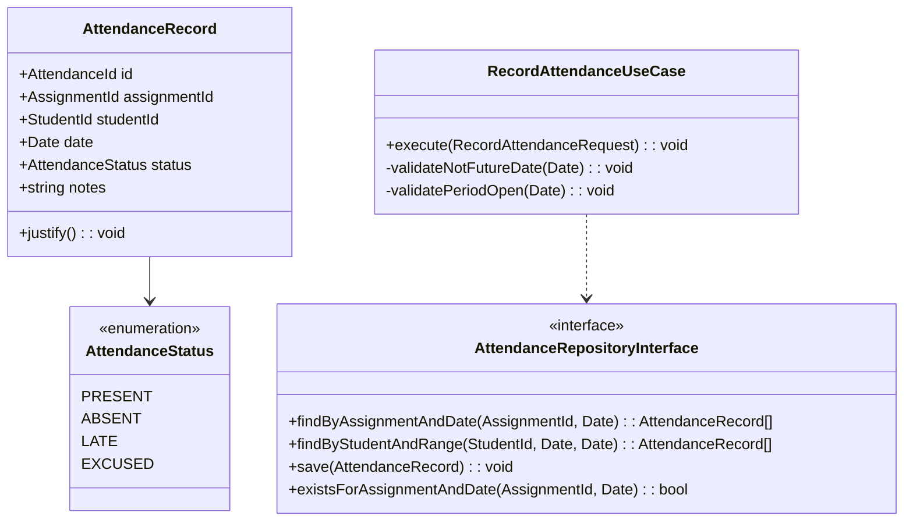

### 9.7 Módulo: Grades (RF-06)

**Responsabilidad:** Registro de calificaciones, cálculo de promedios, cierre de períodos.

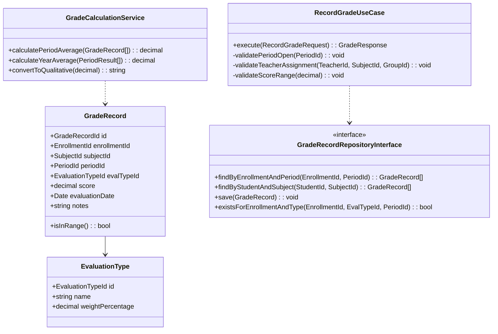

### 9.8 Módulo: Reports (RF-07, RF-08.2)

**Responsabilidad:** Generación de boletines, certificados, consolidados, estadísticas y reportes administrativos en formatos PDF y Excel.

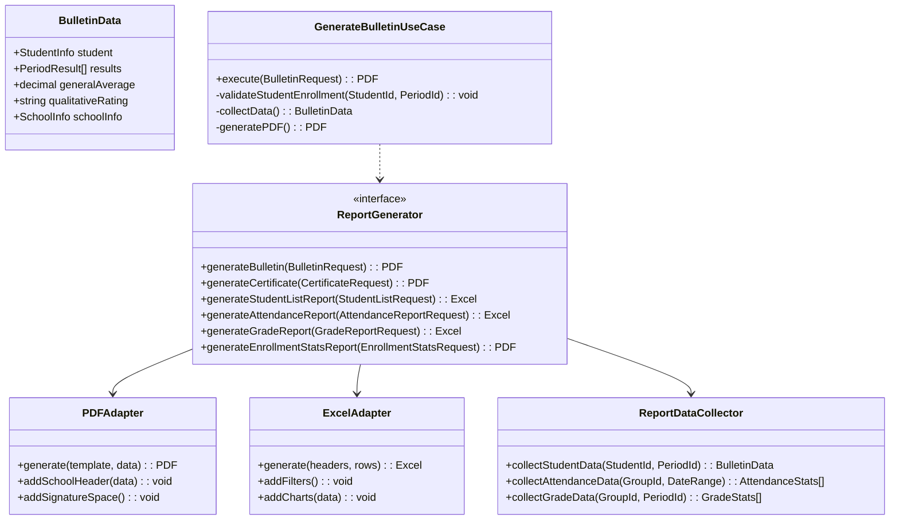

### 9.9 Módulo: Shared / Configuration (RF-08.1)

**Responsabilidad:** Información institucional y parámetros globales del sistema.

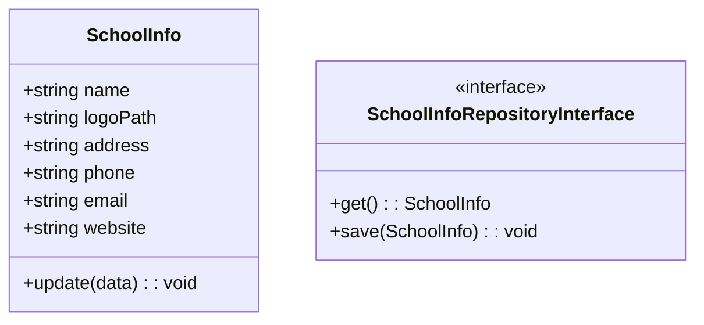

---

## 10. FLUJO DE DATOS ENTRE CAPAS

### 10.1 Flujo General de una Request HTTP

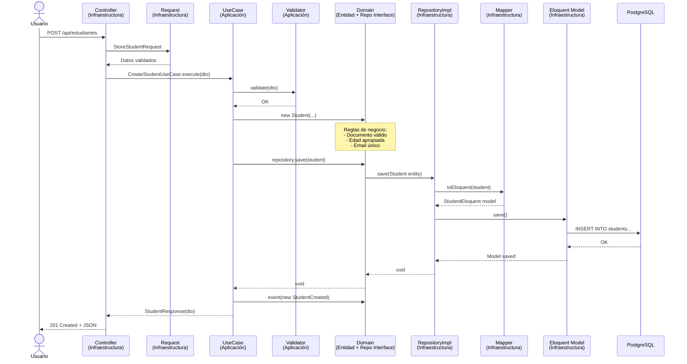

### 10.2 Flujo de Autenticación (RF-01.1)

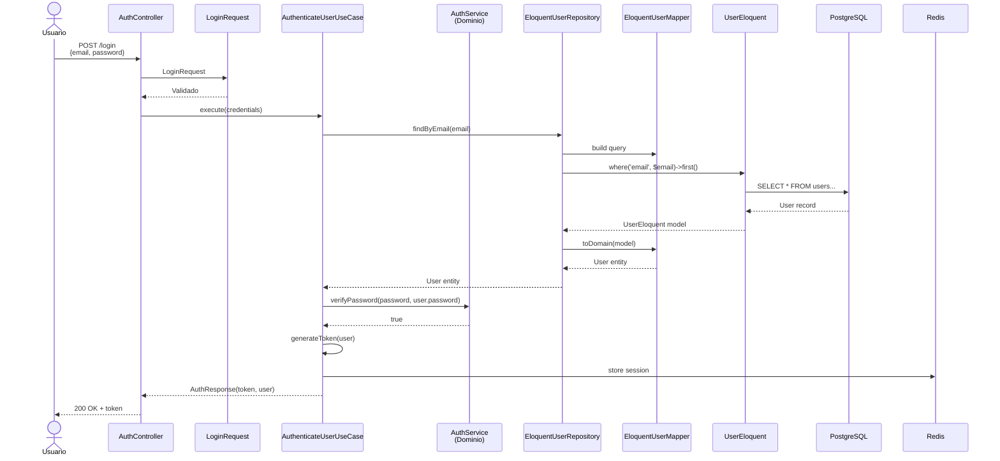

### 10.3 Flujo de Cierre de Período (RF-06.4)

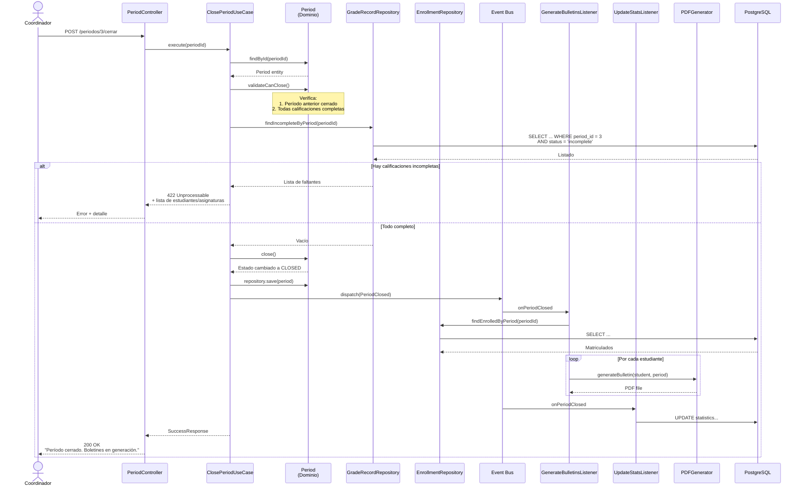

---

## 11. DECISIONES ARQUITECTÓNICAS (ADRs)

### ADR-001: Arquitectura Hexagonal con DDD Táctico

**Estado:** Aceptado  
**Fecha:** 2026-05-07  
**Contexto:** El sistema debe soportar lógica de negocio compleja (matrículas con cupos, cálculo de promedios ponderados, cierre de períodos) sin acoplarse a Laravel o PostgreSQL. Se requiere testabilidad unitaria y posibilidad de evolución a microservicios.

**Decisión:** Aplicar Arquitectura Hexagonal (Ports & Adapters) con Domain-Driven Design táctico. El dominio vive en PHP puro, la aplicación orquesta casos de uso, y la infraestructura adapta Laravel/Eloquent/PostgreSQL.

**Consecuencias:**
- ✅ Dominio desacoplado, testable sin framework
- ✅ Cambio de tecnología posible sin reescribir reglas de negocio
- ✅ Módulos independientes, extracción futura a microservicios viable
- ❌ Curva de aprendizaje para equipo acostumbrado a Laravel tradicional
- ❌ Más código boilerplate (interfaces, mappers, DTOs)

**Alternativas rechazadas:**
- Arquitectura Laravel tradicional (Model-Controller): Acopla negocio a Eloquent, difícil de testear unitariamente
- Microservicios desde inicio: Overhead operativo innecesario para MVP de 15 semanas

---

### ADR-002: Estructura Modular por Dominio

**Estado:** Aceptado  
**Fecha:** 2026-05-07  
**Contexto:** El SRS define 8 dominios funcionales claramente separados. Se necesita que equipos puedan trabajar en paralelo y que el sistema escale por dominio.

**Decisión:** Organizar código en módulos (`src/SMS/Users`, `src/SMS/Students`, etc.) donde cada módulo contiene sus 3 capas (Domain, Application, Infrastructure).

**Consecuencias:**
- ✅ Desarrollo paralelo por equipos especializados
- ✅ Límites claros del dominio
- ✅ Posible extracción futura a servicio independiente
- ❌ Posible duplicación si Shared Kernel no está bien definido
- ❌ Navegación más profunda en árbol de directorios

---

### ADR-003: PostgreSQL 16+ como Base de Datos Única

**Estado:** Aceptado  
**Fecha:** 2026-05-07  
**Contexto:** Se requieren transacciones ACID fuertes (matrículas, calificaciones), integridad referencial compleja, y soporte para datos JSON flexibles (SISBEN, observaciones).

**Decisión:** PostgreSQL 17 único. Eloquent como adaptador ORM en la capa de infraestructura.

**Consecuencias:**
- ✅ Transacciones ACID robustas
- ✅ Integridad referencial con foreign keys
- ✅ Índices avanzados (parciales, GIN, GiST)
- ✅ JSONB para campos semi-estructurados
- ❌ Escalamiento horizontal más complejo que NoSQL

**Alternativas rechazadas:**
- MySQL 8: Menor soporte para JSON avanzado e índices parciales
- MongoDB: Sin transacciones ACID confiables en versiones antiguas para operaciones multi-documento críticas

---

### ADR-004: Laravel 13.x como Framework de Infraestructura

**Estado:** Aceptado  
**Fecha:** 2026-05-07  
**Contexto:** Se necesita un framework PHP maduro con ecosistema amplio para el MVP.

**Decisión:** Usar Laravel 13.x exclusivamente en infraestructura: routing, controllers, Eloquent como adaptador, Blade, Sanctum, Queue, Notification.

**Consecuencias:**
- ✅ Aprovecha ecosistema Laravel (migraciones, seeders, artisan, horizon)
- ✅ Comunidad amplia, documentación extensa
- ✅ El dominio permanece puro PHP, portable
- ❌ Requiere disciplina para no usar facilidades de Laravel en dominio

---

### ADR-005: Escala de Calificación Configurable

**Estado:** Aceptado  
**Fecha:** 2026-05-07  
**Contexto:** Las instituciones educativas colombianas usan diferentes escalas según su PEI. Decreto 1290/2009 sugiere 1.0-5.0, pero muchas instituciones usan 0-100 por tradición.

**Decisión:** DECIMAL(5,2) en PostgreSQL soportando 0-100 (entero) o 0.0-5.0 (decimal). Value Object `GradeScore` valida según configuración en `school_info`.

**Consecuencias:**
- ✅ Flexibilidad institucional (escala por defecto 0-100)
- ✅ Conversión entre escalas si cambia normativa
- ✅ Cálculos precisos sin errores de punto flotante
- ⚠️ Validación en runtime según config institucional

**Configuración:** `school_info.grading_scale_type`, `grading_min`, `grading_max`, `grading_passing_score`

---

### ADR-006: Nomenclatura `groups` (Grupos) en Base de Datos

**Estado:** Aceptado  
**Fecha:** 2026-05-07  
**Contexto:** En Colombia se usa "Grupo A/B/C", no "sección". Alineación con SRS y terminología local.

**Decisión:** Tabla `groups` en BD, mapeo a "Grupo" en UI español.

**Consecuencias:**
- ✅ Consistencia SRS ↔ SAD ↔ Schema
- ✅ Claridad para equipo colombiano
- ✅ Alineación cultural

**Tablas confirmadas:** `groups`, `grade_subject`, `assignments`

## 12. ESTRATEGIA DE PERSISTENCIA

### 12.1 Patrón Repository con Eloquent como Adaptador

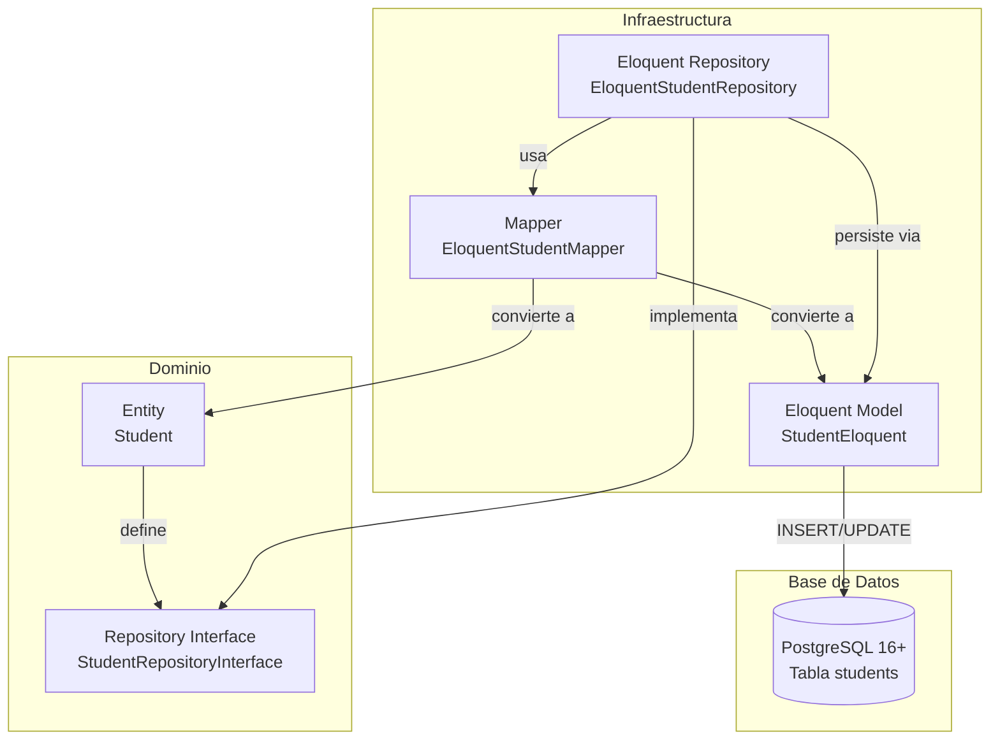

### 12.2 Reglas de Mapeo

| Entidad Dominio | Eloquent Model | Tabla PostgreSQL | Notas |
|----------------|---------------|------------------|-------|
| `User` | `UserEloquent` | `users` | Relación polimórfica con Student/Teacher |
| `Student` | `StudentEloquent` | `students` | Hereda de User via userable |
| `Teacher` | `TeacherEloquent` | `teachers` | Hereda de User via userable |
| `AcademicYear` | `AcademicYearEloquent` | `academic_years` | Constraint: solo uno activo |
| `Period` | `PeriodEloquent` | `academic_periods` | FK a academic_years |
| `Grade` | `GradeEloquent` | `grades` | Catálogo global |
| `Group` | `GroupEloquent` | `groups` | FK a grades, academic_years |
| `Subject` | `SubjectEloquent` | `subjects` | Código único |
| `Enrollment` | `EnrollmentEloquent` | `enrollments` | Constraint único: student + year |
| `AttendanceRecord` | `AttendanceEloquent` | `attendances` | Constraint único: assignment + student + date |
| `GradeRecord` | `GradeRecordEloquent` | `grade_records` | Decimal(3,1) para score |
| `EvaluationType` | `EvaluationTypeEloquent` | `evaluation_types` | Peso configurable |

### 12.3 Índices Críticos PostgreSQL

```sql
-- Índices de unicidad y búsqueda frecuente
CREATE UNIQUE INDEX idx_users_email ON users(email) WHERE deleted_at IS NULL;
CREATE UNIQUE INDEX idx_users_document ON users(document_number, document_type) WHERE deleted_at IS NULL;
CREATE UNIQUE INDEX idx_students_code ON students(student_code);
CREATE UNIQUE INDEX idx_enrollments_student_year ON enrollments(student_id, academic_year_id) WHERE status = 'active';
CREATE UNIQUE INDEX idx_attendance_assignment_student_date ON attendances(assignment_id, student_id, date);

-- Índices de búsqueda
CREATE INDEX idx_students_name ON students USING gin(to_tsvector('spanish', first_name || ' ' || last_name));
CREATE INDEX idx_grade_records_enrollment_period ON grade_records(enrollment_id, academic_period_id);
CREATE INDEX idx_enrollments_group_status ON enrollments(group_id, status);

-- Índices parciales
CREATE INDEX idx_users_active ON users(id) WHERE deleted_at IS NULL;
CREATE INDEX idx_periods_open ON academic_periods(id) WHERE status = 'open';
```

---

## 13. ESTRATEGIA DE EVENTOS DE DOMINIO

### 13.1 Bus de Eventos

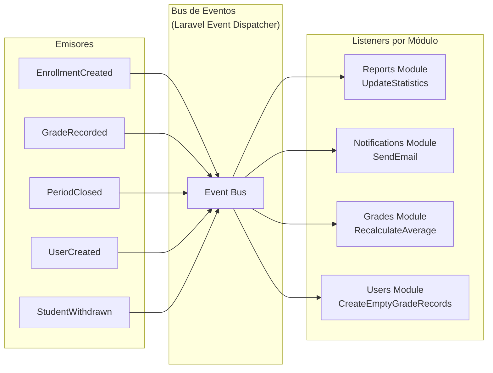

### 13.2 Eventos y Listeners Documentados

| Evento | Emitido por | Escuchado por | Acción |
|--------|------------|---------------|--------|
| `UserCreated` | `Users` domain | `Notifications` infra | Enviar email de bienvenida |
| `UserCreated` | `Users` domain | `Users` infra | Generar email institucional |
| `StudentCreated` | `Students` domain | `Users` infra | Crear registro de autenticación |
| `EnrollmentCreated` | `Enrollments` domain | `Grades` infra | Crear registros de calificación vacíos |
| `EnrollmentCreated` | `Enrollments` domain | `Reports` infra | Actualizar estadísticas de matrícula |
| `GradeRecorded` | `Grades` domain | `Reports` infra | Recalcular promedio del estudiante |
| `GradeRecorded` | `Grades` domain | `Notifications` infra | Notificar acudiente si nota < 3.0 |
| `PeriodClosed` | `Academic` domain | `Reports` infra | Generar boletines masivamente |
| `PeriodClosed` | `Academic` domain | `Grades` infra | Bloquear edición de calificaciones |
| `StudentWithdrawn` | `Enrollments` domain | `Grades` infra | Anular calificaciones pendientes |

---

## 14. ESTRATEGIA DE TESTING

### 14.1 Pirámide de Testing

```mermaid
graph TD
    subgraph "Pirámide de Testing SMS-EDUCOL"
        E2E["🔺 E2E / Browser Tests<br/>Laravel Dusk<br/>5% de casos críticos<br/>Login, matrícula completa, cierre período"]
        
        INT["🔷 Integration Tests<br/>Adaptadores + DB real<br/>25% de cobertura<br/>Repositories, API endpoints"]
        
        UNIT["🔻 Unit Tests<br/>Dominio puro, sin framework<br/>70% de cobertura<br/>Value Objects, Entities, Services"]
    end
    
    style E2E fill:#ffcdd2
    style INT fill:#fff9c4
    style UNIT fill:#c8e6c9
```

### 14.2 Estructura de Tests

```
tests/
├── Unit/
│   └── SMS/
│       ├── Users/
│       │   └── Domain/
│       │       ├── ValueObjects/
│       │       │   ├── EmailTest.php
│       │       │   ├── PasswordTest.php
│       │       │   └── DocumentTest.php
│       │       └── Entities/
│       │           └── UserTest.php
│       ├── Students/
│       │   └── Domain/
│       │       └── Entities/
│       │           └── StudentTest.php
│       └── Grades/
│           └── Domain/
│               ├── ValueObjects/
│               │   └── GradeScoreTest.php
│               └── Services/
│                   └── GradeCalculationServiceTest.php
│
├── Integration/
│   └── SMS/
│       ├── Users/
│       │   └── Infrastructure/
│       │       └── EloquentUserRepositoryTest.php
│       ├── Enrollments/
│       │   └── Infrastructure/
│       │       └── EloquentEnrollmentRepositoryTest.php
│       └── Grades/
│           └── Infrastructure/
│               └── EloquentGradeRecordRepositoryTest.php
│
└── Feature/
    └── SMS/
        ├── Enrollments/
        │   └── EnrollmentFlowTest.php
        ├── Grades/
        │   └── GradeRecordingFlowTest.php
        └── Auth/
            └── AuthenticationFlowTest.php
```

### 14.3 Ejemplo de Test Unitario (Dominio Puro)

```php
// tests/Unit/SMS/Users/Domain/ValueObjects/EmailTest.php

class EmailTest extends TestCase
{
    /** @test */
    public function it_creates_valid_email()
    {
        $email = new Email('usuario@colegio.edu.co');
        
        $this->assertEquals('usuario@colegio.edu.co', $email->value());
    }
    
    /** @test */
    public function it_normalizes_to_lowercase()
    {
        $email = new Email('USUARIO@COLEGIO.EDU.CO');
        
        $this->assertEquals('usuario@colegio.edu.co', $email->value());
    }
    
    /** @test */
    public function it_rejects_invalid_email()
    {
        $this->expectException(InvalidEmailException::class);
        
        new Email('no-es-un-email');
    }
    
    /** @test */
    public function it_validates_colombian_educational_domain()
    {
        $this->expectException(InvalidEmailException::class);
        
        new Email('usuario@gmail.com'); // No es dominio institucional
    }
}
```

### 14.4 Ejemplo de Test de Integración

```php
// tests/Integration/SMS/Users/Infrastructure/EloquentUserRepositoryTest.php

class EloquentUserRepositoryTest extends TestCase
{
    use RefreshDatabase;
    
    private EloquentUserRepository $repository;
    
    protected function setUp(): void
    {
        parent::setUp();
        $this->repository = app(EloquentUserRepository::class);
    }
    
    /** @test */
    public function it_saves_and_retrieves_user()
    {
        // Arrange
        $userId = UserId::generate();
        $email = new Email('test@colegio.edu.co');
        $password = Password::fromPlain('password123');
        $role = Role::STUDENT();
        
        $user = new User($userId, $email, $password, $role);
        
        // Act
        $this->repository->save($user);
        $retrievedUser = $this->repository->findById($userId);
        
        // Assert
        $this->assertNotNull($retrievedUser);
        $this->assertTrue($retrievedUser->id()->equals($userId));
        $this->assertTrue($retrievedUser->email()->equals($email));
        $this->assertTrue($retrievedUser->hasRole($role));
    }
    
    /** @test */
    public function it_finds_user_by_email()
    {
        // Arrange
        $email = new Email('findme@colegio.edu.co');
        $user = UserFactory::create(['email' => $email]);
        $this->repository->save($user);
        
        // Act
        $foundUser = $this->repository->findByEmail($email);
        
        // Assert
        $this->assertNotNull($foundUser);
        $this->assertTrue($foundUser->email()->equals($email));
    }
    
    /** @test */
    public function it_returns_null_when_user_not_found()
    {
        $nonExistentId = UserId::generate();
        
        $user = $this->repository->findById($nonExistentId);
        
        $this->assertNull($user);
    }
}
```

---

## 15. REGLAS DE CODIFICACIÓN ARQUITECTÓNICA

### 15.1 Checklist Obligatorio para Code Review

| # | Regla | Verificación Automática | Severidad |
|---|-------|------------------------|-----------|
| R1 | `Domain/` no importa nada de `Illuminate\`, `Symfony\`, ni vendor | PHPStan custom rule | 🔴 Bloqueante |
| R2 | `Application/` no importa nada de `Illuminate\Database` | PHPStan custom rule | 🔴 Bloqueante |
| R3 | `Infrastructure\Web\Controllers` no contiene lógica de negocio | PHPStan + Review manual | 🔴 Bloqueante |
| R4 | Value Objects son inmutables (sin setters) | PHPStan + Review manual | 🟡 Advertencia |
| R5 | Entidades exponen comportamiento, no datos sueltos | Review manual | 🟡 Advertencia |
| R6 | Repositories reciben/retornan entidades de dominio | PHPStan + Review manual | 🔴 Bloqueante |
| R7 | Eventos de dominio se emiten dentro de entidades | Review manual | 🟡 Advertencia |
| R8 | Un módulo no importa implementaciones de otro módulo | PHPStan custom rule | 🔴 Bloqueante |
| R9 | Todos los Value Objects tienen tests unitarios | Cobertura de código | 🔴 Bloqueante |
| R10 | Todos los UseCases tienen tests de integración | Cobertura de código | 🟡 Advertencia |

### 15.2 Ejemplo de Violación y Corrección

**❌ Violación R1 — Dominio depende de Laravel:**

```php
// src/SMS/Users/Domain/Entities/User.php
namespace Src\SMS\Users\Domain\Entities;

use Illuminate\Support\Collection; // ❌ VIOLACIÓN
use Illuminate\Database\Eloquent\Model; // ❌ VIOLACIÓN

class User extends Model // ❌ VIOLACIÓN
{
    protected $fillable = ['email', 'password']; // ❌ VIOLACIÓN
}
```

**✅ Corrección — Dominio puro:**

```php
// src/SMS/Users/Domain/Entities/User.php
namespace Src\SMS\Users\Domain\Entities;

use Src\SMS\Users\Domain\ValueObjects\Email;
use Src\SMS\Users\Domain\ValueObjects\Password;
use Src\SMS\Users\Domain\ValueObjects\Role;
use Src\SMS\Users\Domain\ValueObjects\UserId;

class User
{
    private UserId $id;
    private Email $email;
    private Password $password;
    private Role $role;
    
    public function __construct(UserId $id, Email $email, Password $password, Role $role)
    {
        $this->id = $id;
        $this->email = $email;
        $this->password = $password;
        $this->role = $role;
    }
    
    public function changePassword(string $newPassword, string $oldPassword): void
    {
        if (!$this->password->verify($oldPassword)) {
            throw new InvalidCredentialsException();
        }
        
        $this->password = Password::fromPlain($newPassword);
    }
    
    public function hasRole(Role $role): bool
    {
        return $this->role->equals($role);
    }
}
```

---

## 16. RIESGOS ARQUITECTÓNICOS

| ID | Riesgo | Probabilidad | Impacto | Mitigación |
|----|--------|-------------|---------|------------|
| RSK-ARCH-001 | Desarrollador usa Eloquent en dominio por hábito | Alta | Medio | PHPStan con reglas custom, code reviews estrictos, template de PR |
| RSK-ARCH-002 | Mappers se vuelven cuello de botella de performance | Media | Medio | Benchmark de mappers, cache de objetos frecuentes, optimización de queries |
| RSK-ARCH-003 | Acoplamiento entre módulos por eventos mal diseñados | Media | Alto | Documentar contrato de cada evento, versionado de eventos, tests de integración |
| RSK-ARCH-004 | Overhead de arquitectura retrasa MVP | Media | Alto | No aplicar hexagonal al 100% en módulos simples (Reports puede ser más pragmático) |
| RSK-ARCH-005 | Cambio de requisitos del MEN rompe el dominio | Baja | Alto | Value Objects para reglas normativas, fácil de cambiar en un solo lugar |
| RSK-ARCH-006 | Brecha digital de docentes dificulta adopción | Alta | Medio | Capacitación presencial, manual impreso, interfaz extremadamente simple |
| RSK-ARCH-007 | Conectividad intermitente en zonas rurales | Media | Medio | Diseño tolerante a latencia, sin operaciones que requieran conexión constante, feedback visual de estado |
| RSK-ARCH-008 | Complejidad de arquitectura hexagonal aumenta curva de aprendizaje | Media | Alto | Capacitación inicial del equipo, pair programming, documentación detallada de patrones |

---

## 17. ANEXOS

### Anexo A: Configuración de composer.json

```json
{
    "name": "sms-educol/sistema",
    "description": "Sistema de Gestión Académica para Instituciones Educativas Colombianas",
    "type": "project",
    "require": {
        "php": "^8.3",
        "laravel/framework": "^13.0",
        "laravel/sanctum": "^4.0"
    },
    "autoload": {
        "psr-4": {
            "App\\": "app/",
            "Src\\SMS\\": "src/SMS/"
        }
    },
    "autoload-dev": {
        "psr-4": {
            "Tests\\": "tests/"
        }
    }
}
```

### Anexo B: Configuración de Service Providers

```php
// bootstrap/providers.php
<?php

return [
    App\Providers\AppServiceProvider::class,
    
    // Módulos SMS-EDUCOL
    Src\SMS\Users\Infrastructure\Providers\UserServiceProvider::class,
    Src\SMS\Students\Infrastructure\Providers\StudentServiceProvider::class,
    Src\SMS\Teachers\Infrastructure\Providers\TeacherServiceProvider::class,
    Src\SMS\Academic\Infrastructure\Providers\AcademicServiceProvider::class,
    Src\SMS\Enrollments\Infrastructure\Providers\EnrollmentServiceProvider::class,
    Src\SMS\Attendance\Infrastructure\Providers\AttendanceServiceProvider::class,
    Src\SMS\Grades\Infrastructure\Providers\GradeServiceProvider::class,
    Src\SMS\Reports\Infrastructure\Providers\ReportServiceProvider::class,
];
```

### Anexo C: Glosario Arquitectónico

| Término | Definición |
|---------|-----------|
| **Entidad (Entity)** | Objeto con identidad propia y ciclo de vida. Tiene comportamiento de negocio. Ej: `User`, `Student` |
| **Value Object (VO)** | Objeto inmutable sin identidad. Se compara por valor. Ej: `Email`, `Document`, `GradeScore` |
| **Repositorio (Repository)** | Interfaz que abstrae la persistencia. El dominio lo define, la infraestructura lo implementa |
| **Caso de Uso (Use Case)** | Orquestador de aplicación que coordina entidades, servicios y repositorios para cumplir un requisito funcional |
| **Puerto (Port)** | Interfaz que define cómo el dominio interactúa con el exterior (entrada o salida) |
| **Adaptador (Adapter)** | Implementación concreta de un puerto usando tecnología específica (Eloquent, Laravel Auth, etc.) |
| **Evento de Dominio** | Notificación de que algo importante ocurrió en el dominio. Desacopla módulos |
| **DTO (Data Transfer Object)** | Objeto plano para transferir datos entre capas sin exponer entidades del dominio |
| **Mapper** | Objeto que convierte entre representaciones (Entity ↔ Eloquent, Entity ↔ DTO) |
| **Bounded Context** | Límite dentro del cual un modelo de dominio es consistente. Cada módulo es un bounded context |
| **Grupo (Group)** | División de estudiantes dentro de un grado. Equivalente a "sección". Ej: 5° A |
| **Asignación (Assignment)** | Relación docente-asignatura-grupo (carga académica) |
| **Matrícula (Enrollment)** | Registro formal de estudiante en grupo para un año lectivo |
| **Año Lectivo** | Período anual académico (feb-nov típicamente en Colombia) |
| **Escala de Calificación** | Sistema numérico configurable: 0-100 o 1.0-5.0 según institución |

---

## CONTROL DE APROBACIONES

| Rol | Nombre | Firma | Fecha |
|-----|--------|-------|-------|
| Arquitecto de Software | | | |
| Líder de Desarrollo | | | |
| Product Owner / Representante Institución | | | |

---

**Fin del Documento de Arquitectura de Software (SAD) v1.0**

**Fecha de elaboración:** 07 de Mayo de 2026  
**Elaborado por:** Equipo de Arquitectura de Software SMS-EDUCOL  
**Estado:** Aprobado para desarrollo

